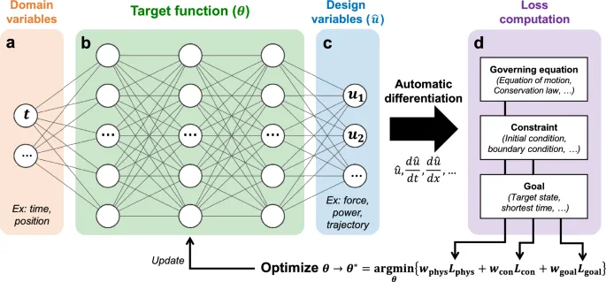

# Physics‑Informed Neural Networks for Nonlinear Models in Finance & Economics
## **Applications of Deep Learning Algorithm PINN to Nonlinear Models Arising in Finance and Economics**
Javed Hussain, Tareq Saeed, Ali Arshad

This repository contains the code and results needed to reproduce the experiments from our paper: _**Applications of deep learning algorithm PINN to nonlinear models arisingin finance and economics**_. We demonstrate how **Physics‑Informed Neural Networks (PINNs)** can be used to solve a variety of nonlinear partial differential equations (PDEs) in option pricing (Black–Scholes, illiquid markets, transaction costs) and a Luttmer‐type growth/diffusion model. 

---

## **PINNs Architecture**



---

_**Physics-Informed Neural Networks (PINNs)**_ are a class of deep learning methods that incorporate physical laws, typically described by PDEs, into the training process of neural networks. This approach allows for the **approximation of solutions to complex PDEs without the need for traditional numerical discretization methods**, which can be computationally intensive or challenging to implement for certain problems.

We apply PINNs to solve several nonlinear PDEs relevant to finance and economics:

- **Option Pricing with Black-Scholes Equation**
- **Black-Scholes Equation for Illiquid Markets**
- **Option Pricing with Transaction Costs**
- **Diffusion and Experimentation as an Engine of Growth**

---

## 📈 Dataset Discussion

Like traditional neural networks, PINNs do not require real-world data for training. Instead, the training dataset is generated computationally and consists of *collocation points*, *initial condition points*, and *boundary condition points*. These are obtained by discretizing the domain, either through meshgrid creation or by random sampling—using frameworks such as `TensorFlow` or `PyTorch`. In our work, we used `TensorFlow`.

To **test and validate** our results, we compare the outputs of the PINN models with numerical solutions reported in the literature. The partial differential equations (PDEs) we solved, along with their corresponding benchmark results, are drawn from previously published studies. **All relevant sources are cited in our paper: _"Applications of Deep Learning Algorithm PINN to Nonlinear Models Arising in Finance and Economics."_**

---

## USAGE

1. Clone the repository:
    ```bash
    git clone https://github.com/DS-Ali-Arshad/Physics-Informed-Neural-Networks-PINNs.git
    cd Physics-Informed-Neural-Networks-PINNs
    ```
2. Install Dependencies:
    The following packages are required to run the notebooks.
    ```
    tensorflow==2.18.0
    numpy==2.0.2
    matplotlib==3.10.0
    scipy==1.14.1
    ```
   Install these packages by using the command.

    ```bash
    pip install -r requirements.txt
    ```
4. Launch Jupyter Notebook:
    ```bash
    jupyter notebook
    ```
5. Open the desired notebook and run the cells sequentially.

---
## 📑 Notebook Summaries

1. **File:** `OPTION_PRICING_WITH_BLACK–SCHOLES_EQUATION.ipynb`

    Implemented one dimensional Option Pricing with Black–Scholes Equation on spatial domain $\mathcal{D}=[0,10]$, and time $t\in[0,1]$.

    $\frac{\partial V}{\partial t}(t,S) - \frac{\sigma^2S^2}{2}\frac{\partial^2 V}{\partial t^2}(t,S) -rS\frac{\partial V}{\partial S}(t,S) + rV = 0$, $(t,S) \in (0,1] \times (0,10)$
    
    $V(0,S) = max\{K-S,0\}$, $x \in (0,10),$
    
    $V(t, 0) = Ke^{-rt}$, $t \in (0,1]$
    
    $V(t, 10) = 0, $t \in (0,1].$
    
    where, $K=4, \sigma=0.3, r=0.03$

3. **File:** `BLACK_SHOLE_EQUATION_FOR_ILLIQUID_MARKET.ipynb`:

    Implemented the Black-Shole equation for illiquid market on spatial domain, $\mathcal{D}=[0,20]$ and time $t\in[0,0.25]$.

    $\frac{\partial V}{\partial t} - \frac{\sigma^2 S^2}{2(1-\rho S \frac{\partial^2 V}{\partial S^2})^2} \frac{\partial^2 V}{\partial S^2}= 0$  $(t,S)\in[0,0.25)\times(0,20)$
    
    $V(0.25,S) = max\{S-E,0\}$ $S\in(0,20)$
    
    $V(t,0)=0$ $t\in[0,0.25)$
    
    $V(t,20)=Ee^{-rt}$ $t\in[0,0.25)$
    
    where, $\sigma=0.2, \rho=0.02, r=0.03, E=10.$

6. **File:** `OPTION_PRICING_WITH_TRANSACTION_COST.ipynb`:

    Implemented the PDE for Option Pricing with Transaction cost on the spatial domain $\mathbf{D}=[0,15]$ and time $t\in[0,1]$.

    $\frac{\partial V}{\partial t} + \frac{1}{2}\sigma^2 S^2 \frac{\partial^2 V}{\partial S^2} + rS\frac{\partial V}{\partial S} - rV -\kappa \sigma S^2 \sqrt{\frac{2}{\pi \delta t}} |\frac{\partial^2 V}{\partial S^2} = 0$    $(t,S)\in[0,1)\times(0,15)$
    
    $V(1,S) = max\{S-E,0\} = (S-E)^+$    $S\in(0,15)$
    
    $V(t, 0) = Ke^{-rt}$,   $t \in [0,1)$
    
    $V(t, 10) = 0$,    $t \in [0,1).$
    
    Where, $\sigma=0.1, r=0.01, E=8, \kappa=0.1, \delta=0.1$

8. **File:** `Diffusion_Growth_Model_Experimentation__01.ipynb`:

    Implemented the PDE on the spatial domain $\mathcal{D}=[0,1]$ and time $t\in[0,1]$.

    $\partial_t F -\frac{\sigma^2}{2} \partial_{xx} F = -\alpha F(1-F)$, $(t,x)\in(0,1]\times(0,1)$
    
    $F(0,x) = x^7$, $x\in(0,1)$
    
    $F(t,0) = 0$, $t\in(0,1]$
    
    $F(t,1) = 1$, $t\in(0,1]$
    
    Where, parameters: $\sigma=0.2, \alpha=0.02$

10. **File:** `Diffusion_Growth_Model_Experimentation__02.ipynb`:

    Implemented the PDE on the spatial domain $\mathcal{D}=[0,1]$ and time $t\in[0,1]$.

    $\partial_t F -\frac{\sigma^2}{2} \partial_{xx} F = -\min(\alpha, F(1 - F))$, $(t,x)\in(0,1]\times(0,1)$

    $F(0,x) = x^7$, $x\in(0,1)$
    
    $F(t,0) = 0$, $t\in(0,1]$
    
    $F(t,1) = 1$, $t\in(0,1]$

---

## 📈 Results

- **Solution Surfaces**: 3D solution plots for each PDE.  
- **Loss Curves**: Convergence of the PINN loss over epochs.  

All figures are available in our paper and in the code notebooks `.ipynb` files.

---

## References

1. Raissi, M., Perdikaris, P., & Karniadakis, G. E. (2017). *Physics Informed Deep Learning (Part I).* [arXiv:1711.10561](https://arxiv.org/abs/1711.10561), [DOI](https://doi.org/10.48550/arXiv.1711.10561)

2. Blechschmidt, J., & Ernst, O. G. (2021). *Three Ways to Solve Partial Differential Equations with Neural Networks — A Review.* [DOI](https://doi.org/10.1002/gamm.202100006)

---

## 📄 License

This project is licensed under the MIT License. See [LICENSE](LICENSE) for details.

---

## 👥 Authors & Acknowledgments

- **Javed Hussain** — Sukkur IBA University  
- **Tareq Saeed** — King Abdulaziz University  
- **Ali Arshad** — Sukkur IBA University  

We thank the Physics‑Informed Neural Networks community (Raissi et al.) for their foundational work.
